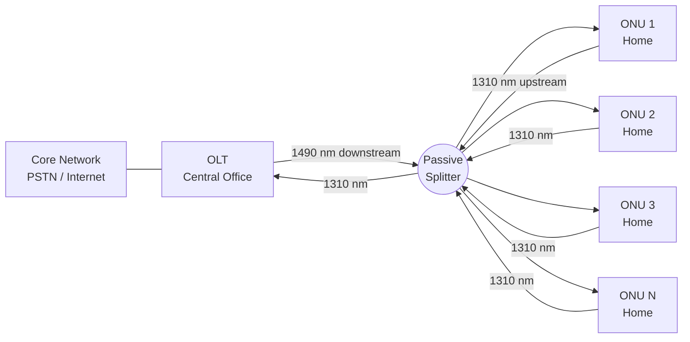
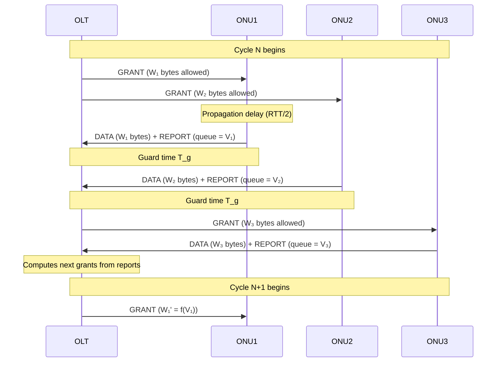
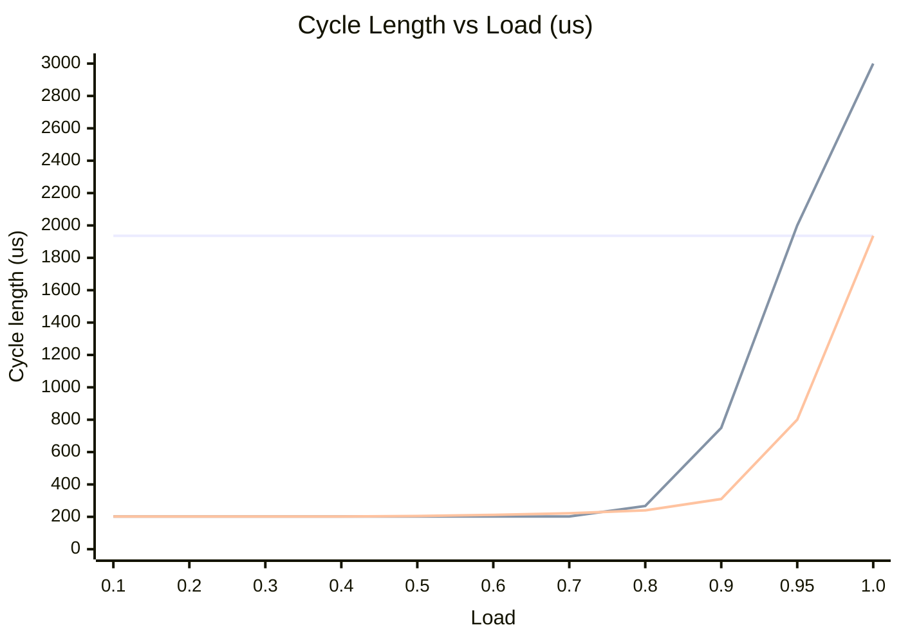
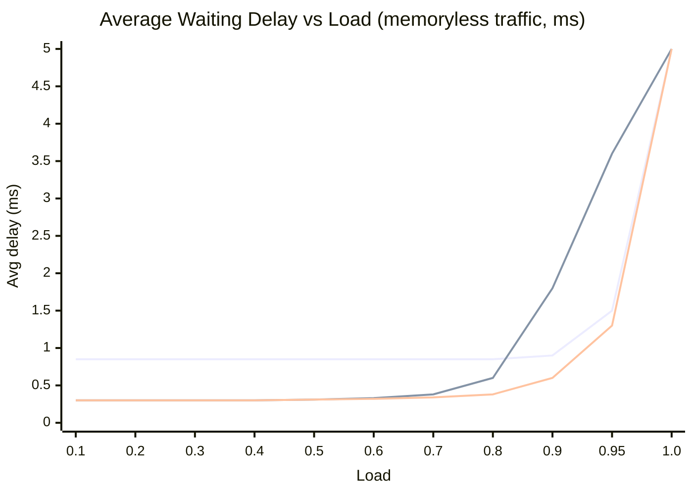

# MOBAN Chapter 6 — Comprehensive Study Guide
# Broadband Access Networks (IPACT)

---

## PART 1: THEORY SUMMARY

---

### 1. Physics & Generic Architecture

#### 1.1 Role of the Access Network

The **access network** connects customer terminals (or customer premises networks) to the backbone/core network. It sits between the LAN and the backbone.

Two classic types of fixed access networks:
- **Twisted pair** — telephone network (PSTN), terminal = telephone, gateway = local exchange (LEX)
- **Coaxial cable** — CATV network, terminal = television, gateway = head end

A third type — **optical fiber** — is now increasingly important in the access network.

#### 1.2 Physical Media

| Medium | Structure | Typical bandwidth |
|--------|-----------|-------------------|
| **Twisted pair** | Two isolated copper wires twisted together; twisting reduces noise sensitivity | ~10 MHz |
| **Coaxial cable** | Central copper wire + copper shield + insulator; excellent noise shielding | ~1 GHz |
| **Optical fiber** | Glass wire with higher-refractive-index core; light guided by total internal reflection | ~10 THz |

**Attenuation** = signal power loss per km, expressed in dB/km:

    Attenuation (dB) = 10 * log10(P_in / P_out)

- e.g., 3 dB/km means power halved every km
- Optical fiber has the **lowest attenuation** in the infrared range (~1300-1550 nm)

#### 1.3 Optical Fiber Physics

**Key relation (wavelength, frequency, speed):**

    lambda * f = v = c / eta

| Symbol | Meaning | Value |
|--------|---------|-------|
| lambda | Wavelength | — |
| f | Frequency | — |
| v | Speed in medium | — |
| c | Speed of light in vacuum | 300,000 km/s |
| eta | Refractive index | ~1 for air; ~1.5 for optical fiber |

**Quick reference calculations:**
- Speed in optical fiber: v = 300,000 / 1.5 = **200,000 km/s**
- RTT over 100 km fiber: RTT = 2 x 100 / 200,000 = **1 ms**
- Infrared at 1500 nm: f = 200,000 x 10^6 / (1500 x 10^-9) = **133 THz**

#### 1.4 Shannon Capacity

The maximum bitrate over a bandwidth-limited noisy channel:

    C = B * log2(1 + SNR)

- **C** = max capacity (bits/s)
- **B** = channel bandwidth (Hz)
- **SNR** = signal power / noise power

> Example: classic telephony — B = 4 kHz, SNR = 1000 (30 dB) → C = 40 kbit/s

#### 1.5 Timeline: Wired Access Technologies

| Technology | Downlink | Uplink | Note |
|------------|----------|--------|------|
| ADSL | up to 12 Mbit/s | 1.3 Mbit/s | — |
| ADSL2+ | up to 24 Mbit/s | 3.5 Mbit/s | — |
| VDSL2 | up to 200 Mbit/s total | — | Belgium: Proximus rollout |
| G.fast | 250-1000 Mbit/s total | — | DSL replacement; <250 m loops |
| FTTB | G.fast over in-building cabling | — | Fiber to basement |
| **Optical fiber** | >1 Gbit/s | — | Only option for Gbit+ |

Access speeds roughly double every 21 months (**Nielsen's Law**).

---

### 2. Optical Fiber Access Technologies

#### 2.1 FTTx: Fiber to the x

Optical fiber gets closer and closer to the user:

```
CO --fiber--> Remote node --copper--> Home   (ADSL/VDSL)
CO --fiber--------------------------------> Home   (FTTH)
CO --fiber--> Building basement -------> Home   (FTTB)
```

| Acronym | Meaning |
|---------|---------|
| **FTTx** | Fiber to the x (generic) |
| **FTTB** | Fiber to the Building/Basement |
| **FTTH** | Fiber to the Home |
| **CO** | Central Office |

**Key FTTH components:**

| Component | Location | Role |
|-----------|----------|------|
| **OLT** (Optical Line Terminal) | Central Office | Sends optical signals; receives upstream from ONUs |
| **Remote Node** | Street cabinet | Passive or active switching/splitting |
| **ONU** (Optical Network Unit) | Customer premises (CPE) | Terminates optical signal at the home |

**Optical communication chain:**

    Info source -> Electrical -> [Laser diode] -> Optical fiber -> [Photo diode] -> Electrical -> Info sink

**FTTH Deployment methods:**
- **Digging**: most common, ~50 EUR/meter; high cost
- **Blowing/pulling**: through pre-installed tubes; cheaper
- **Aboveground**: poles/facades (common in Japan); cheaper but less aesthetic

#### 2.2 FTTH Architectures

| Architecture | Remote node | Pros | Cons |
|-------------|-------------|------|------|
| **Point-to-Point** | Patch panel | Dedicated fiber; max privacy | Expensive (many fibers) |
| **AON** (Active Optical Network) | Ethernet switch | Flexible | Needs power in street cabinet |
| **PON** (Passive Optical Network) | **Passive splitter** | No power needed; cost-efficient | Shared medium — MAC needed |

**PON = most widespread FTTH technology**



> Both wavelengths travel the **same fiber simultaneously** — the WDM diplexer at each end separates them. IPACT is only needed because all ONUs share the **same upstream wavelength**.

---

### 3. TDM-based PON

#### 3.1 PON Basics

- Remote node = **passive power splitter** (no active electronics, no power needed)
- **Shared medium** between all ONUs
- Uses **2 (or 3) wavelengths**:

| Direction | Wavelength | Notes |
|-----------|-----------|-------|
| Upstream | **1310 nm** | ONU to OLT |
| Downstream | **1490 nm** | OLT to ONU |
| Analog video (optional) | **1550 nm** | — |

- Bit rates: 1 Gbps up to 10 Gbps (shared among all ONUs)

#### 3.2 Downstream Traffic

**Downstream = point-to-multipoint:**
- OLT broadcasts packets to all ONUs through the splitter
- Each ONU **filters** and keeps only packets addressed to it
- No collision problem (only one sender: the OLT)

#### 3.3 Upstream Traffic

**Upstream = multipoint-to-point:**
- Multiple ONUs share a single fiber toward the OLT
- Without coordination there are **collisions** at the splitter
- Solution: **MAC protocol** (TDM) assigning each ONU a time slot

#### 3.4 Bandwidth Allocation

| Type | Mechanism | Pros | Cons |
|------|-----------|------|------|
| **Fixed bandwidth allocation** | Equal slot size for all ONUs | Simple, fair | Inefficient; wastes bandwidth; higher delay |
| **Dynamic bandwidth allocation (DBA)** | Slot size proportional to ONU load | Efficient; lower delay | More complex |

---

### 4. IPACT — The DBA Protocol for EPON

**IPACT = Interleaved Polling with Adaptive Cycle Times**

#### 4.1 How IPACT Works

IPACT operates in a **round-robin** cycle:

1. **OLT sends GRANT** to an ONU — grants permission to send W bytes
2. **ONU sends DATA** (upstream) during its granted window
3. **ONU appends REPORT** at the end of data — tells OLT how many bytes are waiting in its queue
4. **OLT computes next GRANT** based on the REPORT — perfectly times the next slot
5. **Guard band (T_g)** between consecutive ONU transmissions avoids collisions



> The OLT **pipelines** grants — it sends GRANT to ONU2 while ONU1's data is still in flight. The grant size `f(V)` depends on the discipline: Fixed ignores `V`, Gated sets `W=V`, Limited sets `W=min(V, W_max)`.

#### How does an ONU know when it is allowed to transmit?

The GRANT message contains **two** pieces of information:
1. **Window size** — how many bytes the ONU is allowed to send
2. **Start time (timestamp)** — the exact moment the ONU must begin transmitting

The OLT knows the RTT to every ONU (measured during registration) and uses it to **pre-calculate** exactly when each upstream burst will arrive at the splitter, so slots fit together without colliding:

    OLT computes:
      "ONU 2's grant travels RTT/2 = 100 µs to reach ONU 2.
       ONU 1 finishes at time T.
       So I tell ONU 2: start transmitting at T + T_g - RTT/2,
       so its signal arrives at the splitter at exactly T + T_g."

**On the ONU side:**
- Receives the GRANT (on 1490 nm downstream)
- Reads the start timestamp from the GRANT
- Waits until that exact moment
- Fires its upstream burst (on 1310 nm)

**Why the guard time T_g = 1 µs exists:**
Timing can never be perfect — slight clock drift, small distance measurement errors, etc. The guard time is a safety margin so no two ONUs ever overlap at the splitter even with minor inaccuracies.

**Why ONUs cannot just "listen before transmitting" like Ethernet:**
- The splitter is **passive** — it combines signals blindly with no intelligence
- An ONU cannot hear other ONUs' upstream traffic (the upstream signal has already passed the splitter heading toward the OLT before any ONU could detect it)
- Collision avoidance **must be centrally scheduled** by the OLT — not distributed

> The OLT is the conductor, the GRANT is the baton cue, and each ONU plays exactly when told.

The cycle length adapts to the total traffic load — hence **adaptive cycle times**.

#### 4.2 Key Parameters (reference scenario)

| Parameter | Symbol | Value |
|-----------|--------|-------|
| Number of ONUs | N | 16 |
| OLT-ONU distance | d | 20 km |
| Max window size | W_max | 15,000 bytes |
| Guard time | T_g | 1 us |
| Buffer size | — | 10 MB |
| REPORT / GRANT message size | — | 64 bytes |
| Upstream line rate | R | 1 Gbps |
| Refractive index | eta | 1.5 |
| Speed in fiber | v | 200,000 km/s |

#### 4.3 IPACT Service Disciplines

The OLT decides how much to grant (W_i) based on the ONU's request (V_i):

| Discipline | Grant formula | Behavior |
|------------|--------------|----------|
| **Fixed** | W_i = W_max | Always grants fixed max; ignores REPORT; full fairness |
| **Gated** | W_i = V_i | Grants exactly what is requested; fully adaptive; can be unfair |
| **Limited** | W_i = min(V_i, W_max) | Compromise: caps grant at W_max; prevents starvation |

**Cycle length across disciplines and loads:**



> Charts not fully accurate, for illustration purposes only

> **Fixed** (top, flat 1936 µs) · **Gated** (middle, RTT-limited until ~L=0.8, then diverges — capped at 3000 µs, actually →∞ at L=1) · **Limited** (bottom, grows slowly, converges back to 1936 µs at L=1 since all ONUs always have W_max bytes ready)

#### 4.4 Important Timing Formulas

**RTT:**

    RTT = 2 * d / v

For d = 20 km, v = 200,000 km/s: RTT = **200 us**

**Transmission time of W_max:**

    T_Wmax = 15000 * 8 / 10^9 = 120 us

> Amount of bits / bitrate

**Transmission time of REPORT or GRANT (64 bytes):**

    T_ctrl = 64 * 8 / 10^9 = 0.512 us ~ 0.5 us

**Minimum cycle length (Gated/Limited):**

    T_cycle_min = RTT + T_report + T_grant = 200 + 0.5 + 0.5 = 201 us

This is the absolute minimum — the OLT must wait for the RTT before it can act on a REPORT.

#### 4.5 IPACT Fixed — Analysis

**Cycle length (constant):**

    T_cycle = N * (T_Wmax + T_g) = 16 * (120 + 1) = 1936 us

**Waiting time summary:**

| Scenario | Waiting time |
|----------|-------------|
| Minimum | 0 (packet arrives exactly when slot begins) |
| Maximum (low load) | T_cycle - T_Wmax = 1936 - 120 = 1816 us |
| Average (low load) | (15/16) * 908 = 851 us |
| Saturation | ~1.3 s (buffer fills up) |

**Throughput:**

    Guard overhead = N * T_g = 16 * 1 us = 16 us per cycle
    Max throughput = (1936 - 16) / 1936 * 1 Gbps ~ 990 Mbps

#### 4.6 IPACT Gated — Analysis

**Cycle length (load-dependent) — derivation:**

Two equations, one unknown (X = data transmission time per ONU per cycle):

**Equation 1 — Cycle structure** (N ONUs, each sending data X + overhead per slot):

    T = N × (X + T_report + T_g)
    T = 16 × (X + 1.5 us)
    T = 16X + 24 us

**Equation 2 — Load definition** (L = fraction of upstream capacity used by data):

    L = (N × X) / T    -->    16X = L × T

**Solve** (substitute Eq.2 into Eq.1):

    T = L×T + 24
    T(1 - L) = 24
    T = 24 / (1 - L)   [us]      <-- correct derivation
    (course notes write 24/[L*(1-L)] — close at high load but cannot be derived from first principles)

**Apply for L = 0.1 (low load):**

    T = 24 / (1 - 0.1) = 24 / 0.9 = 26.7 us

26.7 us < RTT minimum of 201 us → formula invalid — the cycle can never be shorter than the RTT. Use the physical minimum instead:

    T = RTT + T_report + T_grant = 200 + 0.5 + 0.5 = 202 us

**Apply for L = 0.99 (high load):**

    T = 24 / (1 - 0.99) = 24 / 0.01 = 2400 us  (~2424 us from end results)

> The 24 us = fixed overhead per cycle (16 ONUs × 1.5 µs each). At high load (1-L is tiny) the denominator shrinks → cycle blows up. At low load the formula gives a cycle shorter than the RTT, which is physically impossible → RTT = 201 µs is the hard floor.

| Load | Formula result | Actual cycle |
|------|---------------|-------------|
| L = 0.1 | 26.7 us (< RTT) | **202 us** (RTT-limited) |
| L = 0.99 | **~2400 us** | ~2424 us |

**Waiting time:**

| Load | Average waiting time |
|------|---------------------|
| Very low (L -> 0) | 1.5 * 202 = **303 us** |
| High (L = 0.99) | **~3600 us** |
| Saturation | **>= 0.96 s** |

**Throughput/Goodput:**
- Max throughput: **1 Gbps - 25 kbps**
- Max goodput: **1 Gbps - 37 kbps**

#### 4.7 IPACT Limited — Analysis

Behaves like Fixed at low load (cycle = minimum) and approaches Fixed at high load:

| Load | Cycle length | Avg. waiting time |
|------|-------------|-------------------|
| Minimum | 201 us | — |
| L = 0.1 | 202 us | 303 us |
| L = 0.9 | 240 us | 360 us |
| Saturation | — | ~1.3 s |

#### 4.8 IPACT Limited & USRs (Slot Underutilization)

In IPACT Limited, **Ethernet packets cannot be fragmented**. If the granted window is smaller than the head-of-queue packet, that packet **cannot be transmitted** — bandwidth is wasted.

This is called **slot underutilization** or **Unused Slot Remainders (USRs)**.

**Maximum slot underutilization:**

    USR_max = (1518 - 1) / 15000 = 1517 / 15000 ~ 10.1%

*(Worst case: granted slot is 1 byte short of a 1518-byte frame — 1517 bytes wasted)*

**With 2.5% USR assumed:**
- Max throughput: **96.7%**
- Max goodput: **96.3%**

---

### 5. IPACT Performance Graphs

#### 5.1 Delay vs. Load Behavior



> **Fixed** (top, flat ~0.85 ms) · **Gated** (middle, low then diverges fastest — already 3.6 ms at L=0.99) · **Limited** (bottom, lowest until near saturation)
> At L=1.0 all three disciplines diverge to infinity in theory (queues grow without bound). In practice buffers fill → **packets drop** → system stabilises at a lossy operating point. Chart capped at 5 ms; real saturation delays reach seconds.

**Fixed:**
- Baseline delay ~851 µs at low load — **flat and high** regardless of load
- Stays flat until load approaches 1, then spikes sharply
- High baseline because cycle length never shrinks even when ONUs have little traffic

**Gated:**
- Very low delay at low load (~303 µs) — cycle contracts to minimum
- Delay slowly increases with load as cycle grows
- Near saturation: delay diverges (queues grow unboundedly)

**Limited:**
- Same low delay as Gated at low load (~303 µs)
- Stays lower than Gated up to moderate load
- Spikes sharply near saturation (like Fixed) because W_max caps prevent the cycle from shrinking enough

#### 5.2 Key Insights

- **Limited is best at low-to-medium load** (short cycle + fairness)
- **Gated is best at very high load** (no W_max cap — can drain queue faster)
- **Fixed always has the highest baseline delay** but also the most predictable timing
- **Bursty traffic** amplifies the differences between disciplines more than memoryless traffic

---

### 6. PON Standards

| Standard | DS rate | US rate | Reach | Split ratio |
|----------|---------|---------|-------|-------------|
| **EPON** | 1.25 Gbps | 1.25 Gbps | 10-20 km | 1:16 |
| **GPON** | 2.5 Gbps | 1.25 Gbps | 20 km | 1:32 to 1:128 |
| **10G-EPON** | 10.3 Gbps | 1.25/10.3 Gbps | 10-20 km | 1:16/32 |
| **XG-PON** | 10 Gbps | 2.5/10 Gbps | 20 km | 1:32 to 1:128 |

> **GPON allows packet fragmentation** — no USR problem, higher throughput, more flexible cycle lengths.

---

### 7. Next-Generation PON

#### 7.1 Motivation

- Higher aggregate bandwidth (>=40 Gbit/s per feeder fiber)
- Node consolidation: fewer COs, long-reach PON
- Smooth migration path from TDM-PON

#### 7.2 WDM-PON

Each ONU gets a **dedicated wavelength** (no time sharing, no MAC protocol needed).

| Variant | Frequency spacing | Wavelength range | # Wavelengths |
|---------|------------------|-----------------|---------------|
| **CWDM-PON** | >200 GHz | 1271-1611 nm | 18 |
| **DWDM-PON** | 100/50 GHz | C-band (1530-1565 nm) | 40-80 |
| **UDWDM-PON** | 12.5 GHz | C-band | 320 |

**AWG vs. power splitter at remote node:**
- **AWG** (Arrayed Waveguide Grating): fixed 3 dB insertion loss; routes each wavelength to specific ONU
- **Power splitter**: insertion loss = 3*log2(n) dB; ONU selects wavelength with tunable filter

#### 7.3 Other NG-PON Technologies

- **TWDM-PON**: Time + Wavelength Division Multiplexing; standard for NGPON-2
- **OFDM-PON**: uses OFDM modulation for flexible spectrum allocation per user

---

### 8. Market Evolution

- **Asia** (Japan, South Korea): almost exclusively fiber-based new broadband equipment
- **Europe**: mix of cable, copper (VDSL), and fiber
- **OECD (2021)**: Fibre = 32.1%, Cable modem = 33.8%, DSL = 28.7%
- Large difference between countries in copper vs. fiber penetration (OECD broadband chart)

---

## PART 2: EXERCISES WITH SOLUTIONS

---

### Reference Scenario (all exercises)

| Parameter | Value |
|-----------|-------|
| N (ONUs) | 16 |
| d (distance OLT-ONU) | 20 km |
| W_max | 15,000 bytes |
| T_g (guard time) | 1 us |
| Buffer size | 10 MB |
| REPORT / GRANT size | 64 bytes |
| R (upstream line rate) | 1 Gbps |
| Traffic | Uniform load, memoryless |

**Pre-computed values:**
- v = 300,000 / 1.5 = **200,000 km/s**
- RTT = 2 x 20 / 200,000 = **200 us**
- T_Wmax = 15,000 x 8 / 10^9 = **120 us**
- T_report = T_grant = 64 x 8 / 10^9 = **0.5 us**

---

### Exercise 1: IPACT Fixed

**a) RTT**

    RTT = 2 * d / v = 2 * 20 / 200,000 = 200 us

**b) Cycle length**

Every ONU always sends W_max bytes:

    T_cycle = N * (T_Wmax + T_g) = 16 * (120 + 1) = 1936 us

**c) Minimum waiting time**

A packet arrives right when the ONU's slot begins — it is transmitted immediately:

    W_min = 0

**d) Maximum waiting time at low load (L -> 0)**

A packet arrives right after the ONU's slot ends — must wait almost a full cycle:

    W_max = T_cycle - T_Wmax = 1936 - 120 = 1816 us

**e) Average waiting time at low load (L -> 0)**

- 1/16 of packets arrive during ONU's own slot: wait = 0
- 15/16 arrive outside: wait uniformly between 0 and 1816 us, avg = 908 us

    W_avg = (15/16) * 908 = 851 us

**f) Average waiting time at high load (L -> infinity / saturation)**

Buffer fills completely. Service rate per ONU = (120/1936) * 1 Gbps = 62 Mbps.
At saturation, buffer = 10 MB must drain:

    W_sat ~ buffer / service_rate = (10 * 10^6 * 8) / (62 * 10^6) ~ 1.3 s

**g) Maximum burst at 100 Mbps before packet loss**

Net fill rate of buffer = 100 - 62 = 38 Mbps:

    t_burst = (10 * 10^6 * 8) / (38 * 10^6) ~ 2.1 s

**h) Maximum throughput**

Guard overhead = N * T_g = 16 * 1 us = 16 us per cycle (16,000 bits):

    Throughput_max = (1936 - 16) / 1936 * 1 Gbps ~ 990 Mbps

**i) Maximum goodput**

REPORT and GRANT overhead is small (only 16 us total) relative to 1936 us cycle:

    Goodput ~ 990 Mbps

**j) Understanding the delay vs. load graph for Fixed**

- Delay is approximately constant (~851 us) regardless of load until close to saturation
- This is because the cycle length never changes — even idle ONUs still occupy their full slot
- Near load = 1 the delay spikes sharply as queues overflow

---

### Exercise 2: IPACT Gated

**a) Minimum cycle length**

The OLT must wait for the RTT before acting on a REPORT:

    T_cycle_min = RTT + T_report + T_grant = 200 + 0.5 + 0.5 = 201 us

**b) Average cycle length at very low load (L = 0.1)**

At very low load each ONU requests almost nothing — cycle is RTT-limited:

    T_cycle ~ 202 us

**c) Average cycle length at high load (L = 0.99)**

Using load formula (valid for higher loads):

    T_cycle = N * (T_report + T_g) / [L * (1-L)]
            = 16 * 1.5 us / [0.99 * 0.01]
            = 24 / 0.0099
            ~ 2424 us

**d) Average waiting time at very low load**

Waiting time = between 1 and 2 cycle lengths; average = 1.5 * T_cycle:

    W_avg = 1.5 * 202 = 303 us

**e) Average waiting time at high load (L = 0.99)**

    W_avg ~ 3600 us

*(The cycle is ~2424 us; waiting time grows proportionally)*

**f) Average waiting time at saturation**

The derivation links directly to h) (throughput). From h), the guard-time overhead = 25 kbps:

    overhead_rate = N * T_g * R / T_cycle = 16 * 1 us * 1 Gbps / T_cycle = 16,000 bits / T_cycle

Set equal to 25 kbps to find the saturation cycle:

    16,000 bits / T_sat = 25,000 bps
    T_sat = 16,000 / 25,000 s = 0.64 s = 640 ms

Apply the same waiting time formula used in d) (packet waits between 1 and 2 cycles, average 1.5):

    W_sat >= 1.5 * T_sat = 1.5 * 640 ms = 960 ms >= 0.96 s

The "≥" is because T_sat = 640 ms is a reference cycle — as load pushes further toward 1, T_cycle only grows larger so the waiting time can only increase.

> h) and f) use the same reference cycle (T = 640 ms): h) gives the overhead rate at that cycle (25 kbps), and f) gives 1.5 × that cycle as the minimum waiting time (0.96 s). Two sides of the same coin.

**g) Average queue filling at 50 Mbps arrival rate**

    Queue fill = W_avg * arrival_rate = 303 us * 50 Mbps = 303e-6 * 50e6 = 15.15 kbit ~ 16 kbit

**h) Maximum throughput**

Overhead = guard times = 16 * 1 us = 16 us per cycle minimum.
At max throughput cycle = minimum:

    Throughput_max = 1 Gbps - 25 kbps

**i) Maximum goodput**

Also subtracting REPORT + GRANT:

    Goodput_max = 1 Gbps - 37 kbps

**j) Understanding the delay vs. load graph for Gated**

- At low load: delay is very low (~303 us) because cycle shrinks to minimum
- As load increases, cycle grows and delay grows
- Near saturation: delay diverges (queues grow without bound)
- Much better than Fixed at low-medium load

---

### Exercise 3: IPACT Limited

**a) Minimum cycle length**

Same as Gated (RTT-limited):

    T_cycle_min = 201 us

**b) Average cycle length at very low load**

    T_cycle ~ 202 us

**c) Average cycle length at high load (L = 0.9)**

Limited caps grants at W_max but cycle still grows slightly:

    T_cycle ~ 240 us

**d) Average waiting time at very low load**

    W_avg ~ 303 us

*(Same as Gated at low load — identical short cycle)*

**e) Average waiting time at high load (L = 0.9)**

    W_avg ~ 360 us

**f) Average waiting time at saturation**

    W_sat ~ 1.3 s

**g) Understanding the delay vs. load graph for Limited**

- Same low delay as Gated at low load
- Better than Gated at medium load (cycle doesn't grow as fast)
- Worse than Gated near saturation (W_max cap prevents efficient draining)
- Summary: Limited is the best choice for low-to-medium load scenarios

---

### Exercise 3bis: IPACT Limited & USRs

**a) Maximum % slot underutilization**

Worst case: granted slot is 1 byte less than a full 1518-byte Ethernet frame:

    USR_max = (1518 - 1) / 15000 = 1517 / 15000 ~ 10.1%

**b) Maximum throughput assuming 2.5% USR**

Guard time overhead: 16 * 1 us = 16 us out of 1936 us cycle:

    Total overhead = guard overhead + USR overhead
    (1936 - 16) / 1936 * (1 - 0.025) * 1 Gbps ~ 96.7%

    Throughput_max ~ 96.7%

**c) Maximum goodput assuming 2.5% USR**

Also subtracting REPORT/GRANT overhead:

    Goodput_max ~ 96.3%

---

### Exercise 4: Conceptual Reasoning

**4a) Disadvantage of adaptive cycle lengths**

No timing guarantees. The OLT cannot predict exactly when a given ONU will get its next slot because the cycle length depends on all ONUs' instantaneous traffic. This makes it hard to guarantee bounded delay or QoS for real-time traffic (voice, video).

**4b) If W_max increases, does waiting time increase or decrease in Limited?**

It **increases** when the load is high enough to fill the larger W_max slots. With larger W_max, each ONU transmits more per cycle — the cycle length grows — so the waiting time increases. At very low load the effect is minimal (slots rarely reach W_max anyway).

**4c) Why prefer Limited over Gated despite worse performance?**

**Fairness.** In Gated, an ONU with a large backlog receives a proportionally large grant, potentially starving other ONUs for multiple cycles. Limited caps the grant at W_max, ensuring all ONUs get service within each cycle — guaranteed max-min fairness and bounded service time.

**4d) Credit-based grant sizing (OLT grants more than requested)**

Benefits (+):
- Can also send packets that arrived at the ONU **after** the REPORT was sent (during the RTT)
- Reduces wasted cycle time at high constant load
- Better efficiency for continuous/constant traffic

Drawbacks (-):
- Can be pure overhead at low load — unused credit = wasted bandwidth
- Less fair between ONUs

Performance:
- **Better for high, constant load** (credit is always used)
- **Worse for low/bursty load** (credit often goes unused, wasting bandwidth)

---

**4bis-a) Extended reach to 100 km — minimum average waiting time**

    RTT_100km = 2 * 100 / 200,000 = 1 ms

    T_cycle_min = RTT + T_report + T_grant = 1 ms + 0.5 us + 0.5 us ~ 1.001 ms

    W_avg_min = 1.5 * 1.001 ms ~ 1.5 ms

Voice traffic requires max queuing delay < 1 ms.
Since RTT alone = 1.001 ms > 1 ms, **IPACT cannot satisfy the 1 ms delay bound at 100 km reach.**

**4bis-b) How to improve performance for long reach**

- Reduce number of ONUs per OLT — shorter cycle overhead
- Use **credit-based grant sizing** — allows sending packets that arrive during the long RTT, filling otherwise wasted time. Credit-based is **more beneficial** at long reach because the RTT fraction of the cycle is larger.

**4bis-c) GPON: effect of packet fragmentation**

In GPON packets **can be fragmented** at slot boundaries:
- **No USR problem** — no slot underutilization
- Higher throughput and more flexible cycle lengths
- Throughput and efficiency improve compared to EPON Limited

**4bis-d) REPORT transmitted upfront instead of at end**

If REPORT is sent at the **beginning** of data:
- OLT receives the REPORT earlier (at start of data slot, not end)
- Next GRANT can be sent sooner — potentially shorter round trip — lower delay
- Disadvantage: the REPORT reflects the queue state at the start of transmission, not the end. It may **undercount** bytes that arrive during transmission — less accurate grant — possible inefficiency
- Also, report is then less up-to-date and small — no real advantage, since other ONUs need their chance to send first

---

## PART 3: SUMMARY TABLES & QUICK REFERENCE

---

### Formula Sheet

| Quantity | Formula |
|---------|---------|
| Speed in fiber | v = c / eta = 300,000 / 1.5 = 200,000 km/s |
| RTT | 2 * d / v |
| T_window | W_bytes * 8 / R |
| Fixed cycle | N * (T_Wmax + T_g) |
| Gated min cycle | RTT + T_report + T_grant |
| Gated cycle at load L | N * (T_report + T_g) / [L * (1-L)] |
| Avg waiting (low load) | 1.5 * T_cycle_min |
| Max throughput | (T_cycle - overhead) / T_cycle * R |
| USR_max | (ETH_max_size - 1) / W_max |
| Queue fill | T_wait * arrival_rate |
| Shannon capacity | B * log2(1 + SNR) |

---

### Discipline Comparison

| | Fixed | Gated | Limited |
|--|-------|-------|---------|
| Grant formula | W_i = W_max | W_i = V_i | W_i = min(V_i, W_max) |
| Cycle length | Constant (1936 us) | Variable | Variable (capped) |
| Low-load delay | High (~851 us) | Low (~303 us) | Low (~303 us) |
| High-load delay | Bounded | Growing | Moderate |
| Saturation delay | ~1.3 s | >=0.96 s | ~1.3 s |
| Fairness | Perfect | Poor | Good |
| Max throughput | ~990 Mbps | 1 Gbps - 25 kbps | ~96.7% (with USR) |
| USR problem | No | No | Yes |
| Packet fragmentation | No | No | No |

---

### Common Exam Pitfalls

1. **RTT vs. one-way delay**: RTT = 2 x propagation delay. Always use RTT for min cycle in Gated/Limited.
2. **T_g is one guard band per ONU slot** — not doubled.
3. **Fixed cycle never changes** with load — waiting time is load-independent (only queue depth changes).
4. **Gated cycle CAN be shorter than Fixed**: at low load Gated cycle shrinks to 201 us while Fixed stays at 1936 us.
5. **USR only affects Limited** (not Fixed or Gated) — only Limited can grant a slot smaller than the head-of-queue packet.
6. **Goodput vs Throughput**: Throughput includes REPORT/GRANT overhead; Goodput excludes it.
7. **Waiting time in Fixed at low load is ~851 us, not 0** — even with almost no traffic, a packet must wait for its slot.
8. **Min cycle in Gated can never be less than RTT** — the OLT physically cannot respond to a REPORT before the round-trip time elapses.
