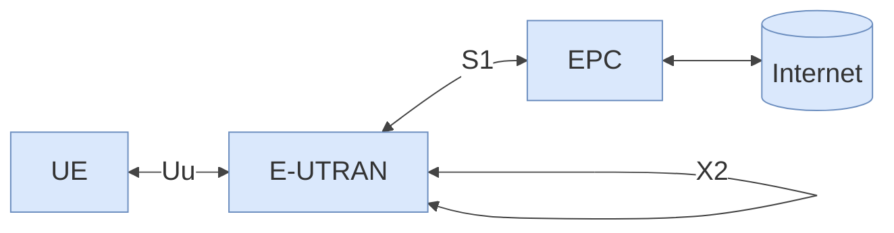

# MOBAN Chapter 7 — Part 2: LTE
# Comprehensive Study Guide

---

## PART 1: THEORY SUMMARY

---

### 1. Introduction

#### 1.1 Motivation and Context

LTE (Long Term Evolution) is a 4G cellular standard developed by 3GPP. It was motivated by several converging pressures on the cellular industry:

| Driver | Detail |
|--------|--------|
| Higher data rates | 3G (UMTS/HSPA) data rates were becoming insufficient for mobile broadband demand |
| Quality of Service | End-to-end QoS guarantees for diverse traffic types (voice, video, data) |
| Packet-switched optimization | Eliminate circuit-switched overhead; all services over IP |
| Cost reduction | Flatter architecture reduces network element count and operational cost |
| Low complexity | Simpler protocol stack to ease implementation and reduce latency |

LTE satisfies the ITU **beyond IMT-2000** requirements:
- Peak downlink rate of **100 Mbps**
- Fully all-IP network architecture

#### 1.2 LTE Requirements

| Requirement | Target |
|-------------|--------|
| Downlink peak rate | 100 Mbps (at 20 MHz bandwidth) |
| Uplink peak rate | 50 Mbps (at 20 MHz bandwidth) |
| Active users per cell | 200 users per cell at 5 MHz bandwidth |
| Mobility | Up to **350 km/h** (at reduced performance) |
| RAN round-trip time | < **10 ms** (radio access network only) |
| Spectrum flexibility | 1.4, 3, 5, 10, 15, 20 MHz channel bandwidths |
| MIMO | 2×2 and 4×4 antenna configurations |

#### 1.3 Duplex Modes

LTE supports both duplex methods:

| Mode | Name | Description |
|------|------|-------------|
| **FDD** | Frequency Division Duplex | Separate frequencies for uplink and downlink; can operate simultaneously |
| **TDD** | Time Division Duplex | Same frequency; uplink and downlink separated in time |

**Belgium spectrum allocation example:**

| Operator | Mode |
|----------|------|
| Proximus | FDD |
| BASE / Telenet | FDD |
| Orange | FDD |
| BUCD / Dense Air | TDD |

#### 1.4 Scale

LTE had **4.69 billion subscriptions** globally in Q3 2025, making it the dominant mobile broadband technology worldwide.

---

### 2. Architecture

#### 2.1 Overall Structure

The LTE system is formally called the **EPS (Evolved Packet System)**:

> **EPS = UE + E-UTRAN + EPC**

**Diagram — LTE End-to-End Architecture**



---

**Architecture element explanations:**

| Abbreviation | Full Name | Contains | Role |
|--------------|-----------|----------|------|
| UE | User Equipment | Client device (phone, modem) | User terminal |
| E-UTRAN | Evolved UMTS Terrestrial Radio Access Network | eNodeBs | Radio access, cell-level mobility, Radio Resource Management |
| EPC | Evolved Packet Core | MME, SGW, PGW, HSS | Core switching, mobility management, gateway to internet |
| Internet | — | — | External packet data network |

**Interfaces at a glance:**

| Interface | Between | Purpose |
|-----------|---------|---------|
| Uu | UE ↔ eNodeB | Radio interface |
| S1 | eNodeB ↔ EPC | Core network access |
| X2 | eNodeB ↔ eNodeB | Direct inter-eNodeB signaling (handover) |

#### 2.2 Flat Architecture vs. UMTS

LTE introduced a "flat architecture" — fewer network hierarchy levels compared to UMTS:

| Aspect | UMTS | LTE |
|--------|------|-----|
| RAN elements | NodeB + RNC (two levels) | eNodeB only (one level) |
| Core elements | SGSN + GGSN (two levels) | SGW + PGW |
| Intelligence in RAN | RNC held most RRM logic | Each eNodeB is fully capable |
| Round-trip delays | Longer (more hops) | Shorter (fewer hops) |

> Key benefit: by removing the RNC layer and pushing RRM intelligence into the eNodeB, LTE achieves shorter round-trip delays and lower latency — critical for the < 10 ms RAN RTT requirement.

#### 2.3 Evolved Packet Core (EPC) Components

**MME (Mobility Management Entity)**

- User profile management
- Authentication and authorization of UEs
- Mobility signaling (tracking area updates)
- Tracking and paging of idle UEs
- Bearer management (setting up and releasing QoS bearers)
- Equivalent to the SGSN signaling plane in UMTS

**SGW (Serving Gateway)**

- Routes user-plane IP traffic between the eNodeB and the PGW
- User-plane anchor for intra-LTE handovers (inter-eNodeB) and inter-3GPP technology handovers
- Buffers downlink packets when the UE is in idle mode

**PGW (Packet Data Network Gateway)**

- IP address and IP prefix allocation for UEs
- Policy enforcement and charging
- Gateway to external packet data networks (internet, IMS)
- Deep packet inspection for QoS and billing

**HSS (Home Subscriber Server)**

- Permanent subscriber database — stores subscriber profiles, authentication vectors, service entitlements
- Functional equivalent of the HLR in GSM
- Works with MME for authentication and authorization

#### 2.4 EPC Component Summary

| Component | Full Name | Role | GSM Equivalent |
|-----------|-----------|------|----------------|
| MME | Mobility Management Entity | Signaling, authentication, paging, mobility | MSC + VLR (control plane) |
| SGW | Serving Gateway | User-plane routing, handover anchor | SGSN (user plane) |
| PGW | Packet Data Network Gateway | IP allocation, charging, gateway | GGSN |
| HSS | Home Subscriber Server | Subscriber database | HLR |

---

### 3. E-UTRAN

#### 3.1 eNodeB (evolved Node B)

The eNodeB is the only type of base station in LTE. It is far more capable than the UMTS NodeB, because it absorbs all the functions that the RNC used to perform:

| Function | Description |
|----------|-------------|
| Radio Resource Management (RRM) | Channel allocation, scheduling, power control |
| Scheduling | Per-subframe (1 ms) assignment of resource blocks to UEs |
| HARQ management | Controls hybrid ARQ retransmission |
| Handover decisions | Decides when and to which cell to hand over |
| Header compression | IP header compression for efficiency |
| Security | Encryption and integrity protection of the air interface |

Each eNodeB:
- Can operate in **FDD mode**, **TDD mode**, or support both
- Connects to the EPC via the **S1 interface**
- Connects directly to neighboring eNodeBs via the **X2 interface**

#### 3.2 X2 Interface

The X2 interface allows **direct eNodeB-to-eNodeB communication** without going through the core network. Key uses:

- Coordinating handover between adjacent eNodeBs
- Exchanging interference coordination information
- Forwarding buffered user-plane packets to the target eNodeB during handover

> In UMTS, all inter-cell coordination had to go through the RNC. The X2 interface in LTE enables faster, more efficient handover.

---

### 4. Radio Interface

#### 4.1 OFDM Downlink

LTE uses **OFDM (Orthogonal Frequency Division Multiplexing)** on the downlink. Key properties:

| Property | Benefit |
|----------|---------|
| Orthogonal subcarriers | Eliminates inter-carrier interference |
| Long symbol duration | Robust against frequency-selective multipath fading |
| Cyclic prefix | Absorbs inter-symbol interference from multipath |
| Flexible bandwidth | Vary the number of subcarriers to match available spectrum |
| Broadcast/multicast | Easy to share the same signal to multiple receivers |

**Subcarrier spacing:** 15 kHz (fixed, regardless of system bandwidth)

**Bandwidth options and corresponding subcarrier counts:**

| Channel BW | Number of Resource Blocks | Number of subcarriers |
|------------|--------------------------|----------------------|
| 1.4 MHz | 6 | 72 |
| 3 MHz | 15 | 180 |
| 5 MHz | 25 | 300 |
| 10 MHz | 50 | 600 |
| 15 MHz | 75 | 900 |
| 20 MHz | 100 | 1200 |

#### 4.2 Uplink: SC-FDMA

The uplink uses **SC-FDMA (Single Carrier Frequency Division Multiple Access)** rather than OFDM. Reason: SC-FDMA has a lower **Peak-to-Average Power Ratio (PAPR)**, which extends UE battery life and allows cheaper power amplifiers in the handset.

#### 4.3 OFDMA Multiple Access

**OFDMA (Orthogonal Frequency Division Multiple Access)** allows the eNodeB to schedule different subcarriers to different UEs within the same 1 ms subframe.

**Resource hierarchy:**

| Unit | Definition | Size |
|------|-----------|------|
| Resource Element (RE) | 1 subcarrier × 1 OFDM symbol | Smallest unit |
| Resource Block (RB) | 12 subcarriers × 1 slot (0.5 ms) | 84 resource elements (12 × 7) |
| Subframe | 2 slots | 1 ms scheduling unit |
| Radio Frame | 10 subframes | 10 ms |

> The eNodeB scheduler assigns resource blocks to UEs on a **per-subframe (1 ms)** basis, enabling fine-grained frequency and time-selective scheduling.

#### 4.4 Frame Structure

```
Radio Frame (10 ms)
  └── 10 × Subframe (1 ms each)
           └── 2 × Slot (0.5 ms each)
                    └── 7 OFDM symbols (normal cyclic prefix)
```

| Parameter | Value |
|-----------|-------|
| Radio frame duration | 10 ms |
| Subframes per frame | 10 |
| Subframe duration | 1 ms |
| Slots per subframe | 2 |
| Slot duration | 0.5 ms |
| OFDM symbols per slot | 7 (normal cyclic prefix) |
| Subcarrier spacing | 15 kHz |
| Resource block bandwidth | 12 × 15 kHz = **180 kHz** |
| Resource elements per RB | 12 subcarriers × 7 symbols = **84** |

#### 4.5 Downlink Physical Channels

LTE defines several physical channels in the downlink, each with a specific role:

| Channel / Signal | Full Name | Purpose |
|-----------------|-----------|---------|
| **PDSCH** | Physical Downlink Shared Channel | Carries user payload data |
| **PDCCH** | Physical Downlink Control Channel | Scheduling assignments and control information |
| **PBCH** | Physical Broadcast Channel | Cell parameters: bandwidth, transmit power, system frame number |
| **PSS** | Primary Synchronization Signal | Gives **NID(2)** — identifies the cell within its group |
| **SSS** | Secondary Synchronization Signal | Gives **NID(1)** — identifies the cell group |
| **CRS** | Cell Reference Signal | Enables RSRP measurement and channel estimation |

> **RSRP (Reference Signal Received Power):** the key measurement metric used for cell selection and handover decisions in LTE. Measured from the CRS.

#### 4.6 MIMO

LTE supports **MIMO (Multiple Input Multiple Output)** antenna configurations:

| Configuration | Description |
|---------------|-------------|
| 2×2 MIMO | 2 transmit antennas at eNodeB, 2 receive antennas at UE |
| 4×4 MIMO | 4 transmit antennas at eNodeB, 4 receive antennas at UE |

MIMO enables:
- **Spatial multiplexing**: transmit independent data streams on each antenna pair — multiplies throughput
- **Beamforming**: focus radiated energy toward a specific UE — improves SNR and reduces interference
- **Transmit diversity**: same data on multiple antennas with different coding — improves reliability

---

### 5. LTE Procedures

#### 5.1 Cell Search

**Why cell search?**

Before a UE can connect to a cell, it must:
1. Find a valid carrier frequency
2. Determine the cell identity
3. Synchronize its timing to the cell

**Types of cell search:**

| Type | Context | Timing constraint |
|------|---------|------------------|
| **Initial cell search** | UE powers on; does not know carrier frequency | No strict timing — scans all possible frequencies |
| **Neighbor cell search** | UE is connected; looking for handover target | Strict timing — must complete within measurement gaps |

**Cell identity structure:**

LTE has **504 unique Physical Cell Identities (PCIs)**:

| Parameter | Description | Range |
|-----------|-------------|-------|
| NID(1) | Cell group identity (from SSS) | 0 – 167 (168 groups) |
| NID(2) | Cell identity within group (from PSS) | 0, 1, or 2 (3 values) |
| **PCI** | Physical Cell ID = **3 × NID(1) + NID(2)** | 0 – 503 (504 values) |

**Cell search sequence:**

```
1. UE detects PSS  →  determines NID(2)  (3 possible sequences)
2. UE detects SSS  →  determines NID(1)  (168 possible sequences)
3. PCI = 3 × NID(1) + NID(2)
4. UE decodes PBCH  →  obtains cell bandwidth, power, system frame number
5. UE reads system information on PDSCH  →  ready to attempt access
```

#### 5.2 Random Access Procedure (Contention-Based)

**Purpose:** Establish uplink synchronization and allocate a C-RNTI (Cell Radio Network Temporary Identifier) to the UE.

**Triggered by:**
- Initial network access (after power-on cell search)
- Radio link failure (re-establishment)
- Handover to a new cell
- Re-entering connected state from idle

**Four-step procedure:**

| Step | Message | Direction | Content |
|------|---------|-----------|---------|
| **1** | RACH Preamble | UE → eNodeB | Random preamble chosen from PRACH resource; establishes initial UL timing |
| **2** | Random Access Response (RAR) | eNodeB → UE | Timing advance correction; UL resource grant; Temporary C-RNTI (TC-RNTI) |
| **3** | RRC Connection Request | UE → eNodeB | UE identity (TMSI or random number); reason for access |
| **4** | Contention Resolution | eNodeB → UE | Echoes UE identity to resolve collisions; assigns permanent C-RNTI |

> Multiple UEs may choose the same preamble in step 1 (collision). The contention resolution in step 4 resolves this — only the UE that sees its own identity echoed back considers the procedure successful.

#### 5.3 Link Adaptation (AMC and HARQ)

**Goal:** always use the most efficient modulation and coding scheme that the current channel quality can support, while keeping the Block Error Ratio (BLER) below **10%**.

**Adaptive Modulation and Coding (AMC) flow:**

```
UE measures SINR on CRS
    → UE reports CQI (Channel Quality Indicator) to eNodeB
        → eNodeB selects MCS (Modulation and Coding Scheme)
            → eNodeB schedules UE with chosen MCS
```

**Modulation options:**

| Modulation | Bits per symbol | When used |
|-----------|----------------|----------|
| QPSK | 2 | Poor channel conditions |
| 16-QAM | 4 | Moderate channel conditions |
| 64-QAM | 6 | Good channel conditions |

**FEC coding rates:** range from **1/8** (very robust, low spectral efficiency) to **4/5** (high spectral efficiency, needs good SNR).

**HARQ (Hybrid Automatic Repeat Request):**
- When a transport block is received with errors, the UE sends a **NACK**
- The eNodeB retransmits the same data
- The UE **combines** the retransmission with the previously received (erroneous) copy — this **incremental redundancy** improves the probability of successful decoding
- Chase combining or incremental redundancy variants

**TPC (Transmit Power Control):**
- eNodeB sends power control commands to UEs
- Goal: minimize uplink interference while maintaining adequate SINR at the eNodeB
- UEs close to the cell center transmit at lower power; cell-edge UEs transmit at higher power

**Frequency-Selective Scheduling:**
- The eNodeB assigns different resource blocks to different UEs based on their instantaneous channel quality
- A UE may have a deep fade on some RBs but good quality on others
- Scheduling is done every **1 ms subframe** — exploits both **frequency diversity** and **multiuser diversity**

#### 5.4 Handover

**Hard handover only:**

Unlike UMTS (which supported soft handover — simultaneous connection to multiple NodeBs), LTE uses **hard handover exclusively**:
- UE is connected to exactly one eNodeB at any moment
- Connection with the old eNodeB is released before (or immediately as) the connection with the new eNodeB is established

**Types of handover:**

| Type | Name | Description |
|------|------|-------------|
| **Horizontal** | Intra-LTE handover | Handover between two LTE eNodeBs |
| **Vertical** | Inter-RAT handover | Handover between LTE and 2G or 3G |

**Event A3 — Handover Trigger:**

The most common handover trigger in LTE. The start condition is:

> **Neighbor RSRP > Serving cell RSRP + Hysteresis (Hys) + Cell Individual Offset**
> ... for a duration exceeding **TTT (Time-To-Trigger)**

The hysteresis and TTT prevent **ping-pong** — repeated handover back and forth between two cells.

**Handover flow (intra-LTE, intra-MME):**

```
1. UE measures neighbor cell RSRP (from CRS) → reports to SeNB (source eNodeB)
2. SeNB evaluates Event A3 trigger condition
3. SeNB sends Handover Request to TeNB (target eNodeB) via X2
4. TeNB admits the UE; reserves resources; sends Handover Request Acknowledge to SeNB
5. SeNB sends RRC Connection Reconfiguration to UE (includes target cell info)
6. SeNB forwards buffered DL packets to TeNB (via X2 data forwarding)
7. UE disconnects from SeNB; performs random access on TeNB
8. UE sends RRC Connection Reconfiguration Complete to TeNB
9. TeNB notifies MME; path is switched in the core network
10. TeNB releases resources at SeNB via X2
```

> During steps 6–9, downlink traffic is **buffered at TeNB** and delivered to the UE once the connection is established — minimizing packet loss.

#### 5.5 Voice Over LTE Options

LTE is a pure packet-switched network with no circuit-switched domain. This creates four approaches to voice calls:

| Approach | Name | How it works | Quality | Complexity |
|----------|------|-------------|---------|------------|
| **OTT** | Over The Top | Voice as a regular data app (Skype, WhatsApp, Signal, Viber) | Variable (best-effort) | None — no network involvement |
| **VoLTE** | Voice over LTE | Voice in PS domain using IMS; dedicated QoS bearer; AMR codec | Best — dedicated radio and core resources | High — requires IMS, QoS, coverage guarantee |
| **CSFB** | Circuit Switched Fallback | At call setup, UE is redirected to 2G/3G for a circuit-switched call | Good (legacy quality) | Medium — requires 2G/3G network and inter-RAT coordination |
| **SRVCC** | Single Radio Voice Call Continuity | Mid-call fallback from VoLTE to CS when UE leaves LTE coverage | Good (seamless transition) | High — requires coordination between LTE core and 2G/3G core |

**Key distinctions:**

- **OTT**: no special network involvement; quality depends on data connection
- **VoLTE**: voice entirely in the packet domain with end-to-end QoS — the "proper" LTE voice solution
- **CSFB**: avoids the need for full VoLTE infrastructure by reusing 2G/3G for voice — used during early LTE deployments
- **SRVCC**: handles the edge case where a VoLTE call is active when LTE coverage ends mid-call

---

## PART 2: SUMMARY TABLES & QUICK REFERENCE

---

### LTE Key Parameters

| Parameter | Value |
|-----------|-------|
| Downlink multiple access | OFDMA |
| Uplink multiple access | SC-FDMA |
| Subcarrier spacing | 15 kHz |
| Resource block bandwidth | 180 kHz (12 × 15 kHz) |
| Resource elements per RB | 84 (12 subcarriers × 7 symbols) |
| OFDM symbols per slot (normal CP) | 7 |
| Slot duration | 0.5 ms |
| Subframe duration | 1 ms |
| Radio frame duration | 10 ms |
| Channel bandwidths | 1.4, 3, 5, 10, 15, 20 MHz |
| Peak DL rate (20 MHz, 4×4 MIMO, 64-QAM) | ~150–300 Mbps |
| Peak UL rate (20 MHz) | ~75 Mbps |
| Maximum mobility | 350 km/h |
| RAN round-trip time target | < 10 ms |
| Physical Cell IDs (PCIs) | 504 |
| Cell groups (NID(1)) | 168 |
| Cells per group (NID(2)) | 3 (values 0, 1, 2) |
| BLER target (AMC) | < 10% |
| Modulation schemes | QPSK, 16-QAM, 64-QAM |
| FEC coding rates | 1/8 to 4/5 |
| MIMO configurations | 2×2, 4×4 |

---

### Architecture Components

| Component | Layer | Full Name | Key Role | GSM/UMTS Equivalent |
|-----------|-------|-----------|---------|---------------------|
| UE | Terminal | User Equipment | User terminal, radio modem | MS |
| eNodeB | E-UTRAN | evolved Node B | Radio access, RRM, scheduling, handover | NodeB + RNC |
| MME | EPC | Mobility Management Entity | Signaling, auth, paging, mobility | MSC + VLR (control) |
| SGW | EPC | Serving Gateway | User-plane routing, handover anchor | SGSN (user plane) |
| PGW | EPC | Packet Data Network Gateway | IP allocation, charging, internet gateway | GGSN |
| HSS | EPC | Home Subscriber Server | Permanent subscriber database | HLR |

---

### Interfaces Summary

| Interface | Between | Protocol / Purpose |
|-----------|---------|-------------------|
| Uu | UE ↔ eNodeB | LTE-Uu radio interface |
| S1-MME | eNodeB ↔ MME | Control-plane (signaling) |
| S1-U | eNodeB ↔ SGW | User-plane (data) |
| X2 | eNodeB ↔ eNodeB | Handover coordination, interference management |
| S11 | MME ↔ SGW | Mobility and bearer management |
| S5/S8 | SGW ↔ PGW | User-plane data (S5 intra-PLMN; S8 roaming) |
| S6a | MME ↔ HSS | Authentication and subscription data |

---

### Physical Downlink Channels and Signals

| Channel / Signal | Abbreviation | Direction | Purpose |
|-----------------|-------------|-----------|---------|
| Physical Downlink Shared Channel | PDSCH | DL | User data payload |
| Physical Downlink Control Channel | PDCCH | DL | Scheduling assignments, control info |
| Physical Broadcast Channel | PBCH | DL | Cell parameters (BW, power, SFN) |
| Primary Synchronization Signal | PSS | DL | NID(2) — cell identity within group |
| Secondary Synchronization Signal | SSS | DL | NID(1) — cell group identity |
| Cell Reference Signal | CRS | DL | RSRP measurement, channel estimation |

---

### Logical Channel Comparison: GSM vs. LTE

| Function | GSM | LTE |
|----------|-----|-----|
| User data | TCH/F, TCH/H | PDSCH (DL) / PUSCH (UL) |
| Control/scheduling | AGCH, PAGCH | PDCCH |
| Broadcast | BCCH, FCCH, SCH | PBCH, PSS, SSS, SIBs on PDSCH |
| Paging | PCH | PDCCH (paging message on PDSCH) |
| Random access | RACH (slotted Aloha) | PRACH (preamble; 4-step procedure) |
| Measurement reference | BCCH beacon | CRS (Cell Reference Signal) |

---

### Voice Call Comparison

| Method | Domain | Network requirement | When used |
|--------|--------|-------------------|----------|
| OTT (WhatsApp etc.) | Packet (app layer) | None (data only) | Any data connection |
| VoLTE | Packet (IMS) | IMS, QoS bearers, full LTE coverage | Modern LTE deployments |
| CSFB | Circuit-switched (2G/3G) | 2G/3G network available | Early LTE; fallback |
| SRVCC | Circuit-switched (handover) | 2G/3G + LTE + SRVCC support in core | Mid-call LTE coverage loss |

---

### Common Exam Pitfalls

1. **EPS vs. EPC**: EPS is the full system (UE + E-UTRAN + EPC); EPC is the core network only — do not use them interchangeably.
2. **LTE uses hard handover only**: unlike UMTS which supports soft handover (UE connected to multiple NodeBs simultaneously), LTE UEs are always connected to exactly one eNodeB at a time.
3. **PCI formula**: PCI = **3 × NID(1) + NID(2)** — NID(1) comes from the SSS (range 0–167), NID(2) comes from the PSS (range 0–2).
4. **PSS gives NID(2), SSS gives NID(1)**: the "primary" signal gives the smaller piece of information (only 3 values); the "secondary" gives the group (168 values).
5. **OFDM vs. OFDMA**: OFDM is the modulation/multiplexing technique (one user fills all subcarriers); OFDMA is the multiple-access extension (different subcarriers assigned to different users per subframe).
6. **Resource block definition**: 12 subcarriers × 1 slot (0.5 ms) = 84 resource elements — not 12 × 10 ms or any other combination.
7. **Scheduling granularity is 1 ms (subframe)**: the eNodeB makes a new scheduling decision every subframe, not every slot or every frame.
8. **eNodeB vs. NodeB**: in UMTS, the NodeB was simple and the RNC held all intelligence; in LTE, the eNodeB is fully autonomous — it handles RRM, scheduling, HARQ, and handover decisions without a separate RNC.
9. **Flat architecture benefit is latency**: the removal of the RNC in LTE (and the reduction from SGSN+GGSN to SGW+PGW in the core) primarily reduces the number of hops and thus round-trip delays.
10. **HARQ combines — it does not simply discard and retry**: the receiver keeps erroneous packets and combines them with retransmissions for improved decoding probability. This is what makes it "hybrid" (FEC + ARQ).
11. **CQI is reported by the UE, MCS is chosen by the eNodeB**: the UE measures the channel and suggests a quality indicator; the eNodeB makes the final scheduling and modulation decision.
12. **CSFB vs. SRVCC timing**: CSFB falls back before the call is established (at call setup); SRVCC falls back during an ongoing call.
13. **Cell search sequence**: PSS first (3 NID(2) hypotheses) → SSS (168 NID(1) hypotheses) → PBCH → system information. Never the other way around.
14. **Random access C-RNTI vs. TC-RNTI**: the TC-RNTI (Temporary) is assigned in the RAR (step 2); the permanent C-RNTI is confirmed only after contention resolution (step 4).
