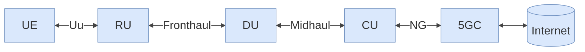

# MOBAN Chapter 7 — Part 3: 5G
# Comprehensive Study Guide

---

## PART 1: THEORY SUMMARY

---

### 1. What is 5G?

#### 1.1 Definitions

- **Qualcomm:** "5G enables a new kind of network that is designed to connect virtually everyone and everything together including machines, objects, and devices… higher multi-Gbps peak data speeds, ultra-low latency, more reliability, massive network capacity, increased availability, and a more uniform user experience."
- **NGMN Alliance:** "5G is an end-to-end ecosystem to enable a fully mobile and connected society… delivering consistent experience… enabled by sustainable business models."

#### 1.2 Three Service Categories

| Category | Abbreviation | Full Name | Target | Key requirement |
|----------|-------------|-----------|--------|-----------------|
| **eMBB** | Enhanced Mobile Broadband | High data rates for smartphones, streaming, AR/VR | 10–20 Gbps peak; 100 Mbps user |
| **URLLC** | Ultra-Reliable Low-Latency Communications | Industrial automation, autonomous vehicles, remote surgery | < 1 ms latency; 99.999% reliability |
| **mMTC / MMTC** | Massive Machine-Type Communications / Massive IoT | Smart cities, sensors, meters | 10⁶ devices/km²; low power, low cost |

> These three categories cannot all be maximised simultaneously — 5G networks use **network slicing** to configure virtual networks optimised for each vertical.

#### 1.3 4G vs. 5G Capability Comparison (from Addestino guest lecture)

| Capability | 4G (LTE) | 5G target |
|-----------|---------|---------|
| Latency | ~100 ms | 1 ms |
| Peak data rate | 1 Gbps | 10–20 Gbps |
| Connection density | ~10⁴/km² | 10⁶/km² |
| Reliability | ~99.99% | 99.999% |
| Speed support | 350 km/h | 500 km/h |

> **Key insight from Addestino:** For warehousing use cases, 4G already meets latency, data rate, and reliability needs. 5G improvements are not yet required for most industrial use cases — 5G's real advantage lies in URLLC + mMTC for future automation and massive IoT.

---

### 2. Challenges

The main 5G challenges span multiple axes:

- **Coverage vs. capacity:** Higher frequencies (mmWave) give massive bandwidth but tiny range; lower frequencies give wide coverage but less bandwidth.
- **Heterogeneous networks:** 5G must coexist with 4G, 3G, Wi-Fi, IoT networks.
- **Latency:** Sub-millisecond latency requires processing close to the user (→ MEC).
- **Energy:** Massive MIMO antenna arrays and dense small cells increase power consumption.
- **Spectrum management:** Limited licensed spectrum must be shared across operators and use cases.

---

### 3. Mobile Network Services

#### 3.1 eMBB (Enhanced Mobile Broadband)
- Smartphones, hotspots, fixed wireless access
- Video streaming, AR/VR, cloud gaming
- Needs wide channels, massive MIMO, mmWave in dense urban areas

#### 3.2 URLLC (Ultra-Reliable Low-Latency Communications)
- Autonomous vehicles, industrial robotics, remote surgery
- Drone control (ASTRID use case from slides)
- Requires < 1 ms end-to-end latency → short slot structure + MEC
- Requires 99.999% reliability → redundant paths, error correction

#### 3.3 mMTC (Massive Machine-Type Communications)
- Smart city sensors, meters, agriculture monitors
- Low data rate, but massive number of devices
- Battery life measured in years
- Uses NB-IoT or LTE-M as complementary technologies

---

### 4. NR (New Radio)

#### 4.1 Spectrum

5G NR uses two frequency ranges:

| Range | Name | Frequencies | Characteristics |
|-------|------|------------|----------------|
| **FR1** | Sub-6 GHz | 450 MHz – 6 GHz | Good coverage, moderate bandwidth; main 5G bands today |
| **FR2** | mmWave | 24.25 – 52.6 GHz | Very high bandwidth; short range, high path loss; needs beamforming |

> FR1 provides coverage; FR2 provides capacity in dense areas.

#### 4.2 Scalable OFDM Numerology

LTE used only 15 kHz subcarrier spacing. 5G NR supports **multiple numerologies** (µ) to serve different use cases:

| µ | Subcarrier spacing (kHz) | Slot duration (ms) | Slots per subframe | Use case |
|---|--------------------------|--------------------|--------------------|---------|
| 0 | 15 | 1 | 1 | Compatible with LTE |
| 1 | 30 | 0.5 | 2 | Most common FR1 |
| 2 | 60 | 0.25 | 4 | FR1 and FR2 |
| 3 | 120 | 0.125 | 8 | FR2 (mmWave) |
| 4 | 240 | 0.0625 | 16 | FR2 reference signals only |

**Fixed durations (like LTE):**
- Subframe = **1 ms** (always)
- Radio frame = **10 ms** (always)

> Smaller subcarrier spacing → longer symbol duration → better multipath tolerance (rural)
> Larger subcarrier spacing → shorter slot → lower latency (URLLC, mmWave)

#### 4.3 Frame Structure

```
Radio frame (10 ms)
  └── 10 subframes (each 1 ms)
        └── N slots per subframe (depends on µ)
              └── 14 OFDM symbols per slot (normal CP)
                    └── 12 or 14 OFDM symbols (CP variant)
```

OFDM symbols per slot: **14** (normal cyclic prefix) or **12** (extended CP)

#### 4.4 Slot Formats

5G NR defines **62 slot formats** (+ 194 reserved) at the symbol level (LTE TDD was defined at subframe level).

Symbol types:
- **D** — Downlink only
- **U** — Uplink only
- **X** — Flexible (can be DL or UL)

Transmission rules:
- DL transmission in **D** or **X** symbols
- UL transmission in **U** or **X** symbols

> This flexibility is key for TDD: the split between DL and UL can be tuned per slot.

#### 4.5 Massive MIMO and Beamforming

**Traditional MIMO** (LTE): up to 4×4 antennas. 5G NR uses **massive MIMO** with tens to hundreds of antenna elements.

Two key techniques:

| Technique | What it does | Benefit |
|-----------|-------------|---------|
| **Beamforming** | Focuses transmitted energy in direction of UE | Longer range, less interference, better SNR |
| **Spatial multiplexing** | Sends multiple data streams simultaneously to same/different UEs | Higher throughput |

**Adaptive beamforming for mmWave:**
- mmWave has very high path loss → without beamforming, range is too short
- Massive antenna arrays create very narrow beams that track the UE
- Critical for making mmWave practical in mobile networks

---

### 5. Architecture

#### 5.1 Cloud RAN (C-RAN) and Open RAN

Traditional cellular RAN: each site has a **BBU** (Baseband Unit) + **RRH** (Remote Radio Head) connected by fronthaul.

**C-RAN:** Centralize BBU processing in a shared pool. Reduces costs, improves coordination.

**Open RAN:** Disaggregate the RAN into three logical nodes with open interfaces:

| Node | Abbreviation | Location | Handles |
|------|-------------|----------|---------|
| Radio Unit | RU | At antenna | RF processing, some L1 |
| Distributed Unit | DU | Near antenna or edge | Real-time L1/L2 processing |
| Centralized Unit | CU | Central/cloud | Non-real-time L2/L3 |

**Transport links:**
- **Fronthaul:** RU ↔ DU (highest bandwidth, strict latency)
- **Midhaul:** DU ↔ CU
- **Backhaul:** CU ↔ Core Network



| Abbreviation | Full Name | Role |
|---|---|---|
| **UE** | User Equipment | User terminal |
| **RU** | Radio Unit | RF processing at antenna |
| **DU** | Distributed Unit | Real-time baseband processing |
| **CU** | Centralized Unit | Non-real-time RAN functions |
| **5GC** | 5G Core | Mobility, routing, policy |
| **NG** | Next Generation interface | CU ↔ 5GC interface |

#### 5.2 Architecture Trade-offs

| Trade-off dimension | Centralized (low split) | Distributed (high split) |
|--------------------|------------------------|-------------------------|
| Fronthaul bandwidth | High | Low |
| AP (DU/RU) complexity | Low | High |
| Processing delay | Non-ideal | Fast (real-time near antenna) |
| Synchronization accuracy needed | High | Low |
| Cost | Higher fronthaul | Higher equipment cost |

> **Key insight:** Real-time functions (beamforming, HARQ) must stay close to the antenna. Non-real-time functions (scheduling policy, mobility) can be centralized. The "functional split" determines where the DU/CU boundary is.

---

### 6. Network Management

#### 6.1 Network Slicing

**What:** Share physical network resources by creating isolated virtual networks (slices), each individually configured for a specific vertical/use case with guaranteed performance characteristics.

**Why needed:** eMBB, URLLC, and mMTC have fundamentally different requirements that cannot all be met by a single network configuration.

**Example slices:**
- Slice A: high bandwidth for video streaming
- Slice B: ultra-low latency for industrial control
- Slice C: low power, massive connections for IoT sensors

#### 6.2 SDN (Software-Defined Networking)

**Traditional networking problem:** Control Plane (CP) and Data Plane (DP) are tightly coupled inside each device. Each device configured individually via CLI.

**SDN solution:**
- **Separate CP from DP** — hide device specifics via hardware abstraction
- **Centralize CP** — one logical programmable network view → configuration = function (global view)
- **Northbound API:** application layer talks to controller
- **Southbound API:** controller talks to network devices (standardized, e.g. OpenFlow)

```
Applications
     ↕ Northbound API
SDN Controller (centralized Control Plane)
     ↕ Southbound API
Network devices (Data Plane only — switches, routers)
```

**Benefits:** Simplified management, programmability, vendor independence, rapid service deployment.

#### 6.3 NFV (Network Function Virtualization)

**Traditional:** Network functions (firewall, load balancer, NAT) run on dedicated proprietary hardware.

**NFV:** Run network functions as software on commodity (standard) hardware. Managed by **MANO** (Management and Orchestration).

**Benefits:** Scale up/down on demand, move functions to optimal location, reduce hardware costs.

#### 6.4 SDN + NFV → Network Slicing

| Technology | Contributes |
|-----------|------------|
| **SDN** | Centralized control of which resources each slice uses |
| **NFV** | Virtualize core network functions; run per-slice instances |
| **Together** | Create isolated end-to-end virtual networks over shared physical infrastructure |

---

### 7. Deployment

#### 7.1 NSA vs. SA

| Mode | Abbreviation | Radio | Core | Description |
|------|-------------|-------|------|-------------|
| **Non-Standalone** | NSA | 5G NR + LTE | LTE EPC | Uses existing LTE infrastructure; 5G NR adds capacity. Easier migration. |
| **Standalone** | SA | 5G NR only | 5G Core | Full 5G; required for URLLC and slicing. |

- **Dual connectivity:** UE connected to both LTE and 5G NR simultaneously in NSA
- Current deployments (2025): mostly NSA → transitioning to SA

#### 7.2 Mobile Edge Computing (MEC)

**Problem:** Latency is related to physical distance — data traveling to a distant cloud introduces delay.

**Solution:** Deploy compute and storage resources **at or near the base station** (at the edge).

- Round-trip time to edge: ~1 ms
- Round-trip time to cloud: ~50–100 ms
- Critical for URLLC (drones, autonomous vehicles, industrial control)

#### 7.3 Public vs. Private Networks

**Public network:** Shared by all users (B2C, B2B, PPDR). Radio frequency shared → congestion possible during crisis events.

**Private network (NPN — Non-Public Network):** Own dedicated infrastructure.

| Deployment type | Antenna | Spectrum | Core | Data |
|----------------|---------|----------|------|------|
| Public network | Telco | Telco | Telco | Off-site |
| Public + private APN | Telco | Telco | Telco | Private routing |
| Public + network slicing | Telco | Telco | Telco (virtual) | Mostly off-site |
| Public + Telco RAN sharing | Telco | Telco | Shared | Off-site |
| **Fully private network** | **Private** | **Dedicated (licensed)** | **On-premise** | **On-site** |

**Citymesh analogy:**
- Public 5G = shared highway (all users compete for same lanes)
- Crisis situation = ring around Brussels at 9am Monday (congested)
- Private 5G = your own private highway lane — you decide who enters

#### 7.4 5G Slicing Risks (from Citymesh guest lecture)

| Risk | Description |
|------|-------------|
| **Single point of failure** | Still uses same physical antenna — if tower fails, all slices fail |
| **Backhaul dependency** | Slicing relies on off-site 5G Core via fiber — cut fiber, slice dies |
| **Shared "pavement"** | In extreme congestion, slice isolation can fail — prioritized slice may still experience jitter |

#### 7.5 Private 5G vs. 5G Slicing Comparison

| Feature | 5G Network Slicing | Private 5G Network |
|---------|-------------------|-------------------|
| Infrastructure | Shared (telco towers, cables) | Dedicated (own mast, radio, server) |
| Core ("brain") | Off-site cloud | On-site (on-premise) |
| Disaster resilience | Vulnerable (fiber cut → slice dies) | Standalone — works without uplink |
| Spectrum | Shared (VIP lane on shared highway) | Exclusive (own private highway) |
| Control | Limited (telco decides) | Absolute (you decide per device) |
| Deployment | Static (telco coverage) | Mobile (deploy anywhere, incl. "black zones") |

---

### 8. Guest Lecture Insights

#### 8.1 Addestino — Real-life 5G Project Cases

**Case 1: Private 5G MPN for Warehousing**

Context: Telecom operator defining private 5G product strategy for warehousing/logistics.

Warehousing problems: Industry 4.0 automation needs; large outdoor+indoor surfaces; changing radio environment (rack contents); critical IT and OT traffic.

WiFi vs. MPN technical comparison:

| Requirement | WiFi capability | MPN (4G/5G) capability |
|------------|----------------|------------------------|
| Security | Config-dependent; often neglected | Built-in SIM auth, encryption, slicing |
| QoS | Best-effort, contention-based | Guaranteed BW, latency, jitter, packet loss |
| Mobility/handover | Mesh: ~seconds interruption | ~ms interruption |
| Capacity | 30–100 devices/AP | 10,000 devices/km² |
| Coverage | ~10m radius per AP | ~km radius per base station |
| Compatibility | Large Wi-Fi device ecosystem | Large 4G ecosystem; 5G still growing |

**TCO conclusion:** MPN makes cost sense for large warehouses (>15,000 m²), especially with outdoor component. Smaller warehouses still favor Wi-Fi on pure cost.

**Do warehouses need 5G or is 4G sufficient?**
- Low latency (100ms 4G vs. 1ms 5G): **4G OK** for current warehouse automation
- Data rate (1 Gbps 4G vs. 10 Gbps 5G): **4G OK**
- Connection density (10⁴/km² 4G vs. 10⁶ 5G): **4G OK** for current scale
- Reliability (99.99% 4G vs. 99.999% 5G): **4G OK** for most cases
- **Conclusion:** 5G improvements are not yet required for typical warehousing — 4G MPN is sufficient today.

---

**Case 2: 5G for Mission-Critical Industrial Plant**

Context: Utility provider with obsolete comms (pagers, DECT, VOIP, TETRA walkie-talkies) — all end-of-support. Must replace within 5 years.

Scenario comparison:
- **Keep existing:** like-for-like replacement of each device type — limited functionality, high ongoing maintenance
- **Private 5G:** single unified platform on one device type; outdoor + indoor deployment; key use cases: digital field ops, push-to-talk, man-down trigger, emergency counting, flexible networks

5G deployment requirements for mission-critical environment:
1. **Safety & regulatory compliance** — certify 5G in safety-regulated plant
2. **Cybersecurity & physical security** — protect against remote compromise, tampering
3. **Electromagnetic compatibility (EMC)** — 5G signals must not interfere with plant instrumentation
4. **Self-sufficiency & operational independence** — must work during external connectivity loss
5. **Future-proofness & organizational acceptance** — avoid vendor lock-in; ensure adoption

> Key insight: TCO and use case fit are only part of the decision. In mission-critical environments, regulatory compliance, cybersecurity, EMC, and operational independence become primary decision criteria.

#### 8.2 Citymesh — Private 5G in Practice

**Citymesh** is a Belgian B2B telecom operator (part of Citymesh Group) offering private 4G/5G networks, IoT, DAS, and TETRA-DMR solutions. Also operates a (mobile) network (DIGI brand).

**Network architecture (Citymesh view):**
```
Internet ← PDN ← Transit ← CORE ← (Backhaul) ← BBU ← (Fronthaul) ← RRH ← UE
                                                    |_____ RAN _____|
```

**Real-world private 5G use cases:**
- **Cosco (Zeebrugge port terminal):** replaced 80+ Wi-Fi APs covering 4G outdoor — bad coverage with containers. Replaced VoIP-on-WiFi with OTT app over private 4G. Operational since 2019.
- **AZ Zeno hospital:** DECT replacement for modern smartphones with scanning, video calling, outside-area calling. Drone transport between hospital campuses. NB-IoT health monitoring bands.
- **Brussels Airport:** Full indoor and outdoor coverage via DAS + leaky feeders. Illustrated by coverage map (purple=deep indoor, red=1st wall, yellow=in-car, green=in-car with booster, blue=outdoor).
- **King's Coronation (London):** Private 5G network deployed along The Mall to support media crews — public network was saturated.
- **Graspop / Dour Festival:** Connected 1,000+ devices over 200,000 m² with max 2 setup points. Temporary deployment by Citymesh Flex division.

---

### 9. Current Status (2025)

- Main focus: **eMBB** and **NSA** deployments
- 5G now available in many populated areas; still rolling out in rural zones
- Belgium: Proximus 5G coverage expanded significantly (from few spots in 2021 to broad coverage by 2025)
- Reality check: individual speeds depend heavily on number of concurrent users; peak rates rarely achieved
- South Korea example: wide 5G coverage but limited new content — hype outpaced reality
- 5G investment is real and growing, but promise of URLLC and mMTC use cases is still materializing

---

## PART 2: SUMMARY TABLES & QUICK REFERENCE

---

### 5G Key Parameters

| Parameter | Value |
|-----------|-------|
| Peak DL data rate (eMBB) | 10–20 Gbps |
| Typical user DL rate | 100 Mbps |
| Peak UL data rate | Several Gbps |
| Latency target (URLLC) | < 1 ms |
| Reliability (URLLC) | 99.999% |
| Connection density (mMTC) | 10⁶/km² |
| Max speed supported | 500 km/h |
| Subframe duration | 1 ms (fixed) |
| Radio frame duration | 10 ms (fixed) |
| Subcarrier spacing range | 15–240 kHz |
| Slot duration range | 0.0625 – 1 ms |
| FR1 frequency range | 450 MHz – 6 GHz |
| FR2 frequency range | 24.25 – 52.6 GHz |

---

### Architecture: 5G vs. LTE vs. GSM

| Generation | RAN | Core | Key difference |
|-----------|-----|------|---------------|
| GSM (2G) | BTS + BSC | MSC + HLR/VLR | Circuit-switched voice |
| LTE (4G) | eNodeB (flat) | EPC (MME+SGW+PGW) | All-IP, flat RAN |
| 5G | gNB / RU+DU+CU | 5GC | Service-based, sliced, cloud-native |

---

### NR Numerology Quick Reference

| µ | SCS (kHz) | Slot (ms) | Slots/subframe | Typical use |
|---|-----------|-----------|----------------|-------------|
| 0 | 15 | 1 | 1 | LTE compatibility, FR1 |
| 1 | 30 | 0.5 | 2 | FR1 mainstream |
| 2 | 60 | 0.25 | 4 | FR1/FR2 |
| 3 | 120 | 0.125 | 8 | FR2 (mmWave) |
| 4 | 240 | 0.0625 | 16 | FR2 reference signals |

---

### Network Slicing Enablers

| Technology | Role in slicing |
|-----------|----------------|
| **SDN** | Centralized control — manages which physical resources each slice gets |
| **NFV** | Virtualizes network functions — runs per-slice software on shared hardware |
| **MEC** | Keeps latency-critical slice processing close to the UE |

---

### Private Network Deployment Options

| Option | Independence | Cost | QoS guarantee | Security |
|--------|-------------|------|---------------|----------|
| Public network | None | Low | Best-effort | Low |
| Private APN | Low | Low-medium | Best-effort | Medium |
| Network slicing | Medium | Medium | Guaranteed (mostly) | Medium-high |
| RAN sharing | Medium | Medium | Best-effort | Medium |
| Fully private network | Full | High | Guaranteed | Highest |

